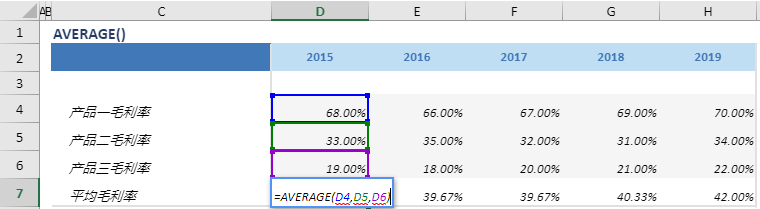

# AVERAGE

## 函数简介

AVERAGE函数用以计算多行（输入行1, 输入行2, …, 输入行n）的平均值，该函数将 输入行1, 输入行2, …, 输入行n 位于同一列的单元格做平均，并赋予输出行对应列的单元格

## 语法

`输出行= AVERAGE(输入行1, 输入行2, …, 输入行n)`

## 示例

例如，上表中的公式

`{平均毛利率}= AVERAGE({产品一毛利率}, {产品二毛利率}, {产品三毛利率})`

将多行 {产品一毛利率}, {产品二毛利率}, {产品三毛利率}位于同一列（例如 列 {2015}）的单元格 (分别为单元格 D4，D5, D6) 做平均，并赋予 {平均毛利率} 对应列 {2015} 的单元格 D7，

转化为单元格 D7 中的Excel公式 =AVERAGE(D4,D5,D6)

单元格 E7, F7, G7, H7 中也遵从类似的逻辑生成单元格公式，如下表所示：

| 单元格 | 公式               |
| ------ | ------------------ |
| E7     | =AVERAGE(E4,E5,E6) |
| F7     | =AVERAGE(F4,F5,F6) |
| G7     | =AVERAGE(G4,G5,G6) |
| H7     | =AVERAGE(H4,H5,H6) |