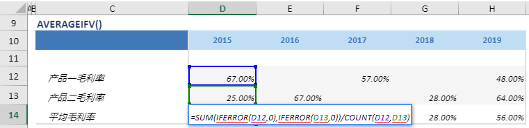

# AVERAGEIF

## 函数简介

AVERAGEIFV函数用以计算两行（输入行1, 输入行2）的平均值，同时忽略空值与错误，并赋予输出行对应列的单元格

## 语法

`输出行= AVERAGEIFV(输入行1, 输入行2)`

## 示例

例如，上表中的公式

`{平均毛利率}= SUM (IFERROR({产品一毛利率}, 0), IFERROR({产品二毛利率}，0})/COUNT({产品一毛利率}, {产品二毛利率})`

将多行 {产品一毛利率}, {产品二毛利率} 位于同一列（例如 列 {2015}）的单元格 (分别为单元格 D12，D13) 做平均，忽略空值与错误，并赋予 {平均毛利率} 对应列 {2015} 的单元格 D14

`转化为单元格 D14 中的Excel公式= SUM(IFERROR(D12, 0), IFERROR(D13 ，0})/COUNT(D12, D13)`

单元格 E14, F14, G14, H14 中也遵从类似的逻辑生成单元格公式，如下表所示：

| 单元格 | 公式                                                              |
| ------ | ---------------------------------------------------------------- |
| E14     | =SUM(IFERROR({E11}, 0), IFERROR({E12}, 0})/ COUNT({E11}, {E12}) |
| F14     | =SUM(IFERROR({F11}, 0), IFERROR({F12}, 0})/ COUNT({F11}, {F12}) |
| G14     | =SUM(IFERROR({G11}, 0), IFERROR({G12}, 0})/ COUNT({G11}, {G12}) |
| H14     | =SUM(IFERROR({H11}, 0), IFERROR({H12}, 0})/ COUNT({H11}, {H12}) |