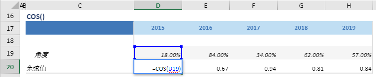

# COS

## 函数简介

COS函数用以返回给定角度的余弦值

## 语法

`输出行= COS(角度)`

## 示例

例如，上表中的公式

`{余弦值} = COS(角度)`

返回行 {角度} 位于列 {2019} 的给定角度的余弦值，并赋予 {余弦值} 对应列 {2019} 的单元格 D20

`转化为单元格 D20 中的Excel公式= COS(D19)`

单元格 E20, F20, G20, H20 中也遵从类似的逻辑生成单元格公式，如下表所示：

| 单元格 | 公式               |
| ------ | ------------------ |
| E20     | = COS(E19) |
| F20     | = COS(F19) |
| G20     | = COS(G19) |
| H20     | = COS(H19) |