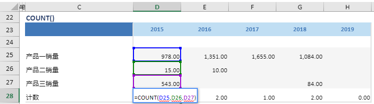

# COUNT

## 函数简介

COUNT函数用以计算多行（输入行1, 输入行2, …, 输入行n）位于同列的包含数字的单元格的个数，并赋予输出行对应列的单元格

## 语法

`输出行= COUNT(输入行1, 输入行2, …, 输入行n)`

## 示例

例如，上表中的公式

`{计数}= COUNT({产品一销量}, {产品二销量}, {产品三销量})`

将多行{产品一销量}, {产品二销量}, {产品三销量}位于同一列（例如 列 {2015}）的其中有数字的单元格 (分别为单元格 D25，D26, D27) 做计数，并赋予对应列 {2015} 的单元格 D28

`转化为单元格 D28 中的Excel公式= COUNT(D25, D26, D27)`

单元格 E28, F28, G28, H28 中也遵从类似的逻辑生成单元格公式，如下表所示：

| 单元格 | 公式               |
| ------ | ------------------ |
| E28     | = COUNT (E25, E26, E27) |
| F28     | = COUNT (F25, F26, F27) |
| G28     | = COUNT (G25, G26, G27) |
| H28     | = COUNT (H25, H26, H27) |