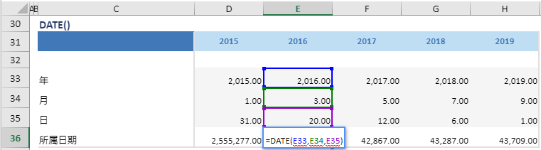

# DATE

## 函数简介

DATE函数用以返回在Excel日期中代表日期的数字

## 语法

`输出行= DATE(年, 月, 日)`

## 示例

例如，上表中的公式

`{所得日期}= DATE(年, 月, 日)`

返回位于同一列（例如 列 {2016}）的单元格 (分别为单元格 E33，E34，E35) 的所属日期，，赋予 至{所属日期} 对应列 {2016} 的单元格 E36

`转化为单元格 E36 中的Excel公式= DATE(E33, E34, E35)`

单元格 D36, F36, G36, H36 中也遵从类似的逻辑生成单元格公式，如下表所示：

| 单元格 | 公式               |
| ------ | ------------------ |
| D36     | = DATE (D33, D34, D35) |
| F36     | = DATE (F36, F34, F35) |
| G36     | = DATE (G36, G34, G35) |
| H36     | = DATE (H36, H34, H35) |