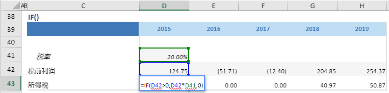

# IF

## 函数简介

IF函数用以判断单行是否满足某个条件，如果满足，则返回第一个值，否则返回另一个值

## 语法

`输出行= IF(条件,为TURE时的返回值，为FALSE时的返回值)`

## 示例

例如，上表中的公式

`{所得税} = IF({税前利润}>0，{税前利润}\*{税率}，0)`

当单行{税前利润}>0（如D42）时，返回{税前利润}\*{税率}（即D42\*D41）至{所得税}所在单元格D43，否则返回0

`转化为单元格 D43 中的Excel公式= IF(D42>0，D42*D41，0)`

单元格 E43, F43, G43, H43 中也遵从类似的逻辑生成单元格公式，如下表所示：

| 单元格 | 公式               |
| ------ | ------------------ |
| E43     | = IF (E42>0, E42*D41,0) |
| F43     | = IF (F42>0, F42*D41,0) |
| G43     | = IF (G42>0, G42*D41,0) |
| H43     | = IF (H42>0, H42*D41,0) |