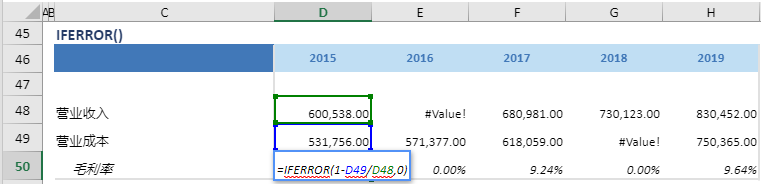

# IFERROR

## 函数简介

IFERROR函数用以判断表达式是否正确，如果是正确的，则返回表达式自身的值，如果是错误的，则返回默认值

## 语法

`输出行= IFERROR(值, 默认值)`

## 示例

例如，上表中的公式

`{毛利率}= IFERROR(1-{营业成本}/{营业收入}, 0)`

当1-{营业成本}/{营业收入} (如1-D49/D48)>0 时，返回该值至{毛利率}所在单元格D50，否则返回默认值0

`转化为单元格 D50 中的Excel公式= IFERROR (1-D49/D48, 0)`

单元格 E50, F50, G50, H50 中也遵从类似的逻辑生成单元格公式，如下表所示：

| 单元格 | 公式               |
| ------ | ------------------ |
| E50     | = IFERROR (1-E49/E48, 0) |
| F50     | = IFERROR (1-F49/F48, 0) |
| G50     | = IFERROR (1-G49/G48, 0) |
| H50     | = IFERROR (1-H49/H48, 0) |