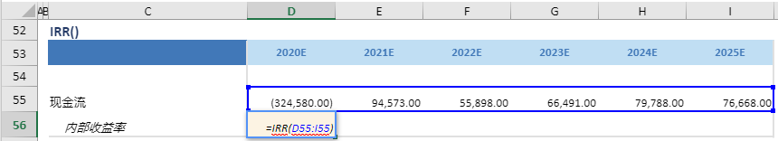

# IRR

## 函数简介

IRR函数用以返回一系列现金流的内部收益率

## 语法

`输出行= IRR(现金流数额)`

## 示例

例如，上表中的公式

`{内部收益率}= IRR({现金流数额})`

对含有投资相关收益或支出的数组或范围（现金流数额中必须至少包含一项负的和一项正的现金流金额才能计算回报率，如{现金流}）计算内部收益率，并赋予{内部收益率}对应列的单元格D56

`转化为单元格 D56 中的Excel公式= IRR(D55:I55)`