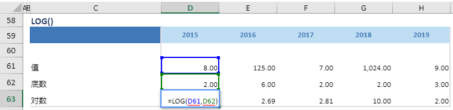

# LOG

## 函数简介

LOG函数能够根据底数返回数值的对数

## 语法

`输出行= COS(值，底数)`

## 示例

例如，上表中的公式

`{对数} = LOG(值，底数)`

根据 {底数} 对应列 {2015} 的单元格 D62 和 {值} 对应列 {2015}的单元格 D61 值，返回{对数} 对应的单元格 D63

`转化为单元格 D63 中的Excel公式= LOG(D61, D62)`

单元格 E63, F63, G63, H63 中也遵从类似的逻辑生成单元格公式，如下表所示：

| 单元格   | 公式               |
| ------  | ------------------ |
| E63     | =  LOG(E61, E62) |
| F63     | =  LOG(E61, E62) |
| G63     | =  LOG(E61, E62) |
| H63     | =  LOG(E61, E62) |