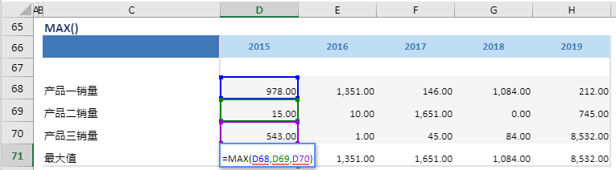

# MAX

## 函数简介

MAX函数能够返回多行数值中的最大值

## 语法

`输出行= MAX(值1,值2,...)`

## 示例

例如，上表中的公式

`{最大值} = MAX(产品一销量，产品二销量，产品三销量)`

判断位于列 {2015} 的三行{产品一销量}、{产品二销量}和{产品三销量} 对应单元格 D68，D69，D70 的最大值，并赋予至 {最大值} 对应列 {2015} 的单元格 D71

`转化为单元格 D71 中的Excel公式= MAX(D68, D69, D70)`

单元格 E71, F71, G71, H71 中也遵从类似的逻辑生成单元格公式，如下表所示：

| 单元格   | 公式               |
| ------  | ------------------ |
| E71     | =  MAX(E68, E69, E70) |
| F71     | =  MAX(F68, F69, F70) |
| G71     | =  MAX(G68, G69, G70) |
| H71     | =  MAX(H68, H69, H70) |