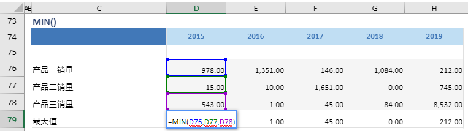

# MIN

## 函数简介

MIN函数能够返回多行数值中的最小值

## 语法

`输出行= MIN(值1,值2,...)`

## 示例

例如，上表中的公式

`{最大值} = MIN(产品一销量，产品二销量，产品三销量)`

判断位于列 {2015} 的三行{产品一销量}、{产品二销量}和{产品三销量} 对应单元格 D68，D69，D70 的最小值，并赋予至 {最小值} 对应列 {2015} 的单元格 D79

`转化为单元格 D79 中的Excel公式= MIN(D76, D77, D78)`

单元格 E79, F79, G79, H79 中也遵从类似的逻辑生成单元格公式，如下表所示：

| 单元格   | 公式               |
| ------  | ------------------ |
| E79     | =  MIN(E76, E77, E78) |
| F79     | =  MIN(F76, F77, F78) |
| G79     | =  MIN(G76, G77, G78) |
| H79     | =  MIN(H76, H77, H78) |