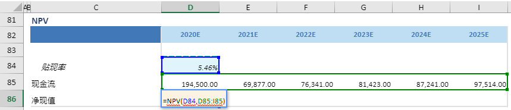

# NPV

## 函数简介

NPV函数能够根据收支现金流和贴现率,返回净现值

## 语法

`输出行= NPV(贴现率, 现金流)`

## 示例

例如，上表中的公式

`{净现值}= NPV({贴现率},{现金流})`

对含有投资相关收益或支出的数组或范围（{现金流}对应整行D85:I85），根据{贴现率} D84，计算净现值，并赋予{净现值}对应列的单元格D86

`转化为单元格 D86 中的Excel公式= =NPV(D84,D85:I85)`