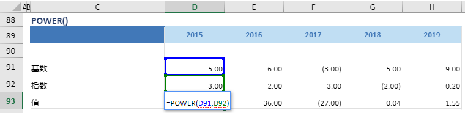

# POWER

## 函数简介

POWER函数能够返回某一数值的某次幂

## 语法

`输出行= POWER(基数, 指数)`

## 示例

例如，上表中的公式

`{值} = POWER(基数, 指数)`

根据 {基数} 对应列 {2015} 的单元格 D91 和 {指数} 对应列 {2015}的单元格 D92 值，返回值 {值} 对应的单元格 D93

`转化为单元格 D93 中的Excel公式= POWER(D91,D92)`

单元格 E93, F93, G93, H93 中也遵从类似的逻辑生成单元格公式，如下表所示：

| 单元格   | 公式               |
| ------  | ------------------ |
| E93     | =  POWER(E91,E92) |
| F93     | =  POWER(F91,F92) |
| G93     | =  POWER(G91,G92) |
| H93     | =  POWER(H91,H92) |