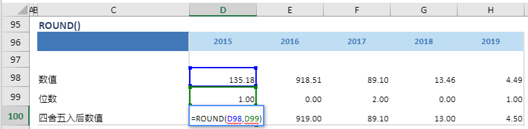

# ROUND

## 函数简介

ROUND函数能按指定位数对数值进行四舍五入（目前只能进行0-2位数的四舍五入）

## 语法

`输出行= ROUND(值, 位数)`

## 示例

例如，上表中的公式

`{四舍五入后数值} = ROUND(值, 位数)`

将位于列 {2019} 的 {数值}（单元格 D98） 以 {位数}（单元格D99）进行四舍五入，并赋予 {四舍五入后数值} 对应列 {2019} 的单元格 D100

`转化为单元格 D106 中的Excel公式= ROUND(D98,D99)`

单元格 E100, F100, G100, H100 中也遵从类似的逻辑生成单元格公式，如下表所示：

| 单元格 | 公式               |
| ------ | ------------------ |
| E100     | = ROUND(E98,E99) |
| F100     | = ROUND(F98,F99) |
| G100     | = ROUND(G98,G99) |
| H100     | = ROUND(H98,H99) |