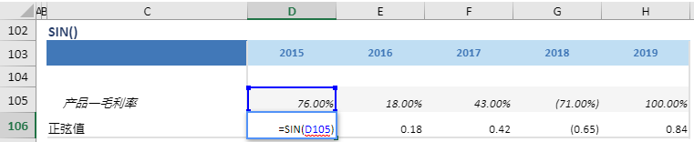

# SIN

## 函数简介

SIN函数用以返回给定角度的正弦值

## 语法

`输出行= SIN(角度)`

## 示例

例如，上表中的公式

`{正弦值} = SIN(角度)`

返回行 {角度} 位于列 {2019} 的给定角度的正弦值，并赋予 {正弦值} 对应列 {2019} 的单元格 D106

`转化为单元格 D106 中的Excel公式= SIN(D105)`

单元格 E106, F106, G106, H106 中也遵从类似的逻辑生成单元格公式，如下表所示：

| 单元格 | 公式               |
| ------ | ------------------ |
| E106     | = SIN(E105) |
| F106     | = SIN(F105) |
| G106     | = SIN(G105) |
| H106     | = SIN(H105) |