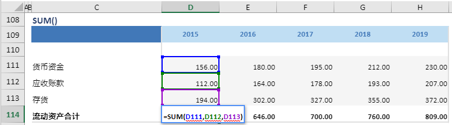

# SUM

## 函数简介

SUM函数用以对应多行区域同列所有数值的和

## 语法

`输出行= SUM(值1, 值2, ...)`

## 示例

例如，上表中的公式

`{流动资产合计} = SUM({货币资金},{应收账款},{存货})`

对多行 {货币资金}, {应收账款}, {存货} 位于同一列 {2019} 的单元格 D111，D112，D113进行加总，并赋予加总值至 {流动资产合计} 对应列 {2019} 的单元格 D114

`转化为单元格 D106 中的Excel公式= SUM(D111,D112,D113)`

单元格 E114, F114, G114, H114 中也遵从类似的逻辑生成单元格公式，如下表所示：

| 单元格 | 公式               |
| ------ | ------------------ |
| E114     | = SUM(E111,E112,E113) |
| F114     | = SUM(F111,F112,F113) |
| G114     | = SUM(G111,G112,G113) |
| H114     | = SUM(H111,H112,H113) |