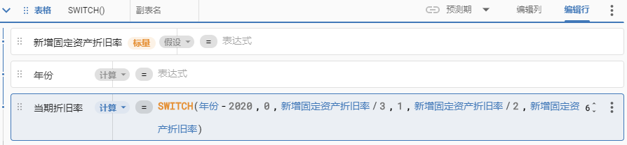
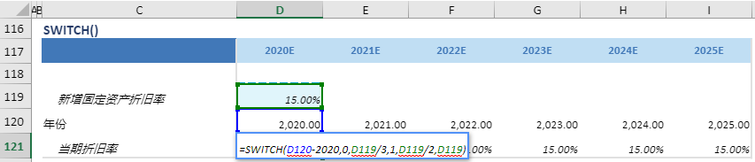

# SWITCH

## 函数简介

SWITCH能够根据计算表达式的值返回与第一个匹配值对应的结果,如果没有匹配项,则返回默认值

## 语法

`SWITCH(表达式, 案例1, 值1, 案例2, 值2, ..., 默认值)`

## 示例

例如，上表中的公式

`{当期折旧率} = SWITCH({年份}-{年份[预测期开始]},0,{新增固定资产折旧率}/3,1,{新增固定资产折旧率}/2,{新增固定资产折旧率})`

当{年份}-{年份[预测期开始]}的值为0时，返回{新增固定资产折旧率}/2，为1时，返回{新增固定资产折旧率}/2，没有匹配项则返回默认值{新增固定资产折旧率}

在{年份} 对应列 {2019} 的单元格中，{年份}-2020 =0，则返回 {新增固定资产折旧率} /2 至 {当期折旧率} 对应的单元格 D121 

`转化为单元格 D121  中的Excel公式= SWITCH(D120-2020,0,D119/3,1,D119/2,D119)`

单元格 E121, F121, G121, H121 中也遵从类似的逻辑生成单元格公式，如下表所示：

| 单元格 | 公式               |
| ------ | ------------------ |
| E121     | = SWITCH(E120-2020,0,D119/3,1,D119/2,D119) |
| F121     | = SWITCH(E120-2020,0,D119/3,1,D119/2,D119) |
| G121     | = SWITCH(E120-2020,0,D119/3,1,D119/2,D119) |
| H121     | = SWITCH(E120-2020,0,D119/3,1,D119/2,D119) |