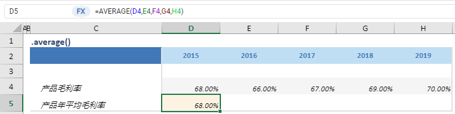

# average

## 函数简介

average函数用以计算区域中数值的平均值

## 语法

`输出行= {计算区域}.average()`

## 示例

例如，上表中的公式

`{产品年平均毛利率}= {产品毛利率}.average()`

将单行{产品毛利率}对应多列（包括{2015}，{2016}，{2017}，{2018}，{2019}）的单元格 D4:H4计算平均，并赋予{产品年平均毛利率对应列{2015}的单元格D5

`转化为单元格 D5 中的Excel公式= AVERAGE (D4, E4, F4, G4, H4)`