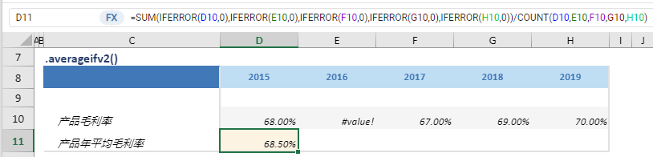

# averageifv2

## 函数简介

averageif函数用以计算区域中数值的平均值，同时忽略空值与错误，并赋予输出行对应列的单元格

## 语法

`输出行= {计算区域}.averageifv2()`

## 示例

例如，上表中的公式

`{产品年平均毛利率} = SUM(IFERROR({产品毛利率[2015]}, 0), IFERROR({产品毛利率[2016]}, 0), IFERROR({产品毛利率[2017]}, 0), IFERROR({产品毛利率[2018]}, 0), IFERROR({产品毛利率[2019]}, 0)) / COUNT({产品毛利率[2015]}, {产品毛利率[2016]}, {产品毛利率[2017]}, {产品毛利率[2018]}, {产品毛利率[2019]})`

将单行{产品毛利率}对应多列（包括{2015}，{2016}，{2017}，{2018}，{2019}）的单元格 D10:H10 做平均，忽略空值与错误，并赋予{产品年平均毛利率}对应列{2015}的单元格D11

`转化为单元格 D11 中的Excel公式= SUM(IFERROR(D10, 0), IFERROR(E10, 0), IFERROR (F10, 0), IFERROR(G10, 0), IFERROR(H10, 0))/ COUNT(D10, E10, F10, G10, H10)`
