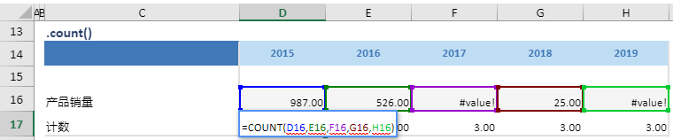

# count

## 函数简介

count函数用以计算区域中包含数值的个数

## 语法

`输出行= {计算区域}.count()`

## 示例

例如，上表中的公式

`{计数}= {产品销量}.count()`

将单行{产品销量}对应多列（包括{2015}，{2016}，{2017}，{2018}，{2019}）的单元格做计数，计算包含数值的单元格的个数，并赋予{计数}对应列{2015}的单元格D5

`转化为单元格 D17 中的Excel公式 =COUNT(D16,E16,F16,G16,H16)`

单元格 E17, F17, G17, H17 中也遵从类似的逻辑生成单元格公式，如下表所示：

| 单元格 | 公式               |
| ------ | ------------------ |
| E17     | = COUNT(D16,E16,F16,G16,H16) |
| F17     | = COUNT(D16,E16,F16,G16,H16) |
| G17     | = COUNT(D16,E16,F16,G16,H16) |
| H517    | = COUNT(D16,E16,F16,G16,H16) |