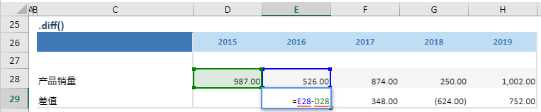

# diff

## 函数简介

diff函数用以计算两个日期对应数值的差值，日期可以是天、月或年

## 语法

`输出行= {计算区域}.diff(日期)`

## 示例

例如，上表中的公式

`{差值}= {产品销量}.diff(1y)`

将单行{产品销量}对应多列的相邻的两个单元格E28，D28 做相减，差值赋予{差值}对应列{2016}的单元格E29

`转化为单元格 E29 中的Excel公式 = E28-D28`

单元格 F29, G29, H18 中也遵从类似的逻辑生成单元格公式，如下表所示：

| 单元格 | 公式               |
| ------ | ------------------ |
| F29    | = F28-E28 |
| G29    | = G28-F28 |
| H29    | = H28-G28 |