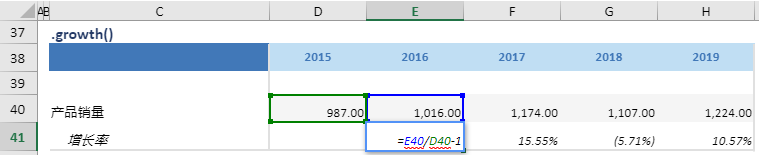

# growth

## 函数简介

growth函数用以计算单行相邻两个数值的增长率

## 语法

`输出行= {计算区域}.growth()`

## 示例

例如，上表中的公式

`{增长率}= {产品销量}.growth()`

对单行{产品销量}的相邻两列（{2015}，{2016}）对应单元格 E40，D40 之间的增长率，赋予至{增长率}对应列{2016}的单元格E41

`转化为单元格 E41 中的Excel公式 = E40/D40-1`

单元格 F41, G41, H41 中也遵从类似的逻辑生成单元格公式，如下表所示：

| 单元格 | 公式               |
| ------ | ------------------ |
| F41    | = F40/E40-1 |
| G41    | = G40/F40-1 |
| H41    | = H40/G40-1 |