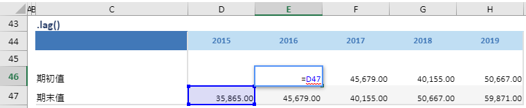

# lag

## 函数简介

lag函数用以将一组数列右移若干个单位

## 语法

`输出行= {计算区域}.lag(时期)`

## 示例

例如，上表中的公式

`{期初值}= {期末值}.lag(1y)`

对单行 {期末值} 对应列 {2015} 的单元格 D47 往右移动一个单元格，赋予至 {期初值} 对应列 {2016} 的单元格E46

`转化为单元格 E46 中的Excel公式 = D47`

单元格 F46, G46, H46 中也遵从类似的逻辑生成单元格公式，如下表所示：

| 单元格 | 公式               |
| ------ | ------------------ |
| F46    | = E47 |
| G46    | = F47 |
| H46    | = H47 |