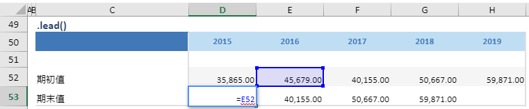

# lead

## 函数简介

lead函数用以将一组数列左移若干个单位

## 语法

`输出行= {计算区域}.lead(时期)`

## 示例

例如，上表中的公式

`{期末值}= {期初值}.lead(1y)`

对单行 {期初值} 对应列 {2016} 的单元格 E52 往做移动一个单元格，赋予至 {期末值} 对应列 {2015} 的单元格D53

`转化为单元格 D53 中的Excel公式 = E52`

单元格 E53, F53, G53 中也遵从类似的逻辑生成单元格公式，如下表所示：

| 单元格 | 公式               |
| ------ | ------------------ |
| E53    | = F52 |
| F53    | = G52 |
| G53    | = H52 |