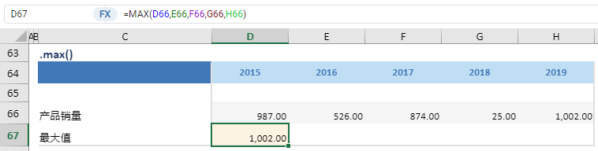

# max

## 函数简介

max函数用以计算单行某区域中所有数值的最大值

## 语法

`输出行= {计算区域}.max()`

## 示例

例如，上表中的公式

`{最大值}= {产品销量}.max()`

对单行 {产品销量} 对应各列的单元格 D66:H66 计算最大值， 赋予至 {最大值} 对应列 {2015} 的单元格D67

`转化为单元格 D67 中的Excel公式 = MAX(D66,E66,F66,G66,H66)`