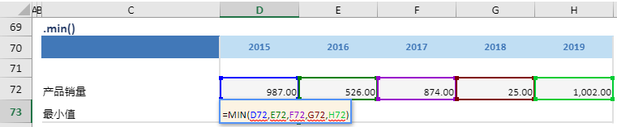

# min

## 函数简介

min函数用以计算单行某区域中所有数值的最小值

## 语法

`输出行= {计算区域}.min()`

## 示例

例如，上表中的公式

`{最小值}= {产品销量}.min()`

对单行 {产品销量} 对应各列的单元格 D72:H72 计算最小值， 赋予至 {最小值} 对应列 {2015} 的单元格D73

`转化为单元格 D73 中的Excel公式 = MIN(D72,E72,F72,G72,H72)`