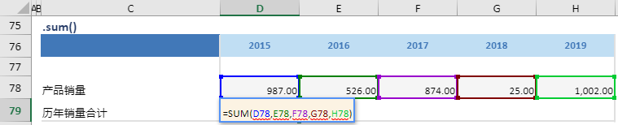

# sum

## 函数简介

sum函数用以计算单行某区域中所有数值的和

## 语法

`输出行= {计算区域}.sum()`

## 示例

例如，上表中的公式

`{历年销量合计}= {产品销量}.sum()`

对单行 {产品销量} 对应各列的单元格 D78:H78 进行求和， 赋予至 {历年销量} 对应列 {2015} 的单元格D79

`转化为单元格 D79 中的Excel公式 = SUM(D78,E78,F78,G78,H78)`